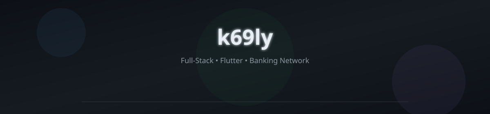

---

## About | نبذة عني

<table>
<tr>
<td width="47%" valign="top" align="right">

### يوسف زاهية
**مهندس برمجيات**

 

**برمجيات**

- مواقع تجارية وشخصية — React، PHP
- تطبيقات موبايل — Android و iOS
- تكامل CBL وأنظمة مصرف ليبيا المركزي
- PostgreSQL · Firebase · REST APIs · Plutu

 

**شبكات وبنية تحتية**

- تأسيس فروع مصرفية (مصرف شمال أفريقيا)
- Cisco · اتصالات · دعم فني ميداني
- تجهيز أقسام الخدمات الإلكترونية

</td>
<td width="6%"></td>
<td width="47%" valign="top" align="left">

### Yosef Zahia
**Software Engineer**

 

**Software**

- Commercial & personal websites — React, PHP
- Mobile apps — Android & iOS
- CBL integrations & banking platforms
- PostgreSQL · Firebase · REST APIs · Plutu

 

**Networks & Infrastructure**

- Banking branch rollout (North Africa Bank)
- Cisco · connectivity · on-site support
- E-banking department setup

</td>
</tr>
</table>

---

## Skills | المهارات

**Web & Backend**

  

**Mobile**

 

  

**Network & Infra**

 

---

## GitHub Activity | النشاط

  

  

---

## Contributions | المساهمات

<picture>
  <source media="(prefers-color-scheme: dark)" srcset="output/github-contribution-grid-snake-dark.svg">
  <source media="(prefers-color-scheme: light)" srcset="output/github-contribution-grid-snake.svg">
  
</picture>

---

## Contact | تواصل

&nbsp;&nbsp;

&nbsp;&nbsp;

&nbsp;&nbsp;

&nbsp;&nbsp;

 

From <a href="https://github.com/k69ly">k69ly</a>

